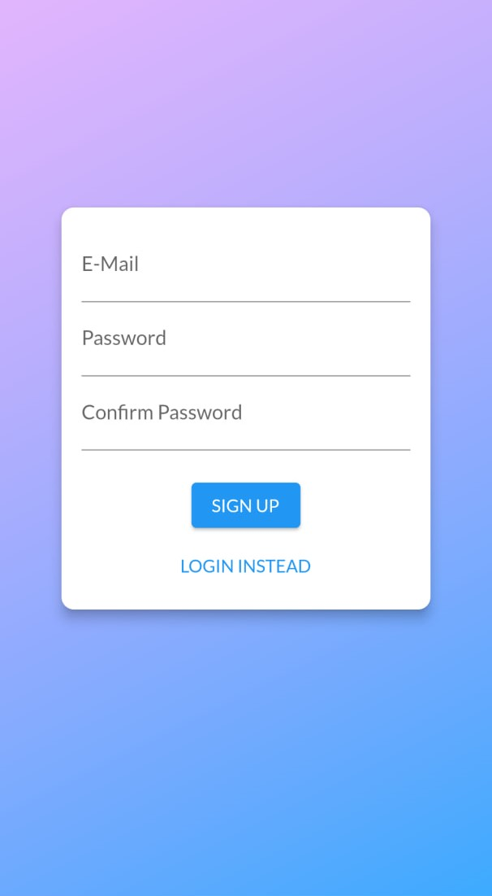
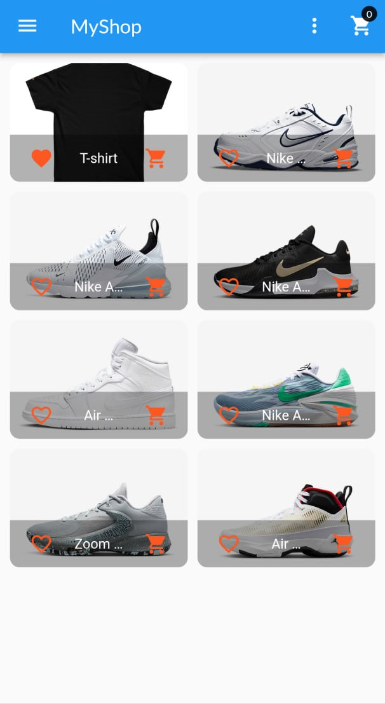
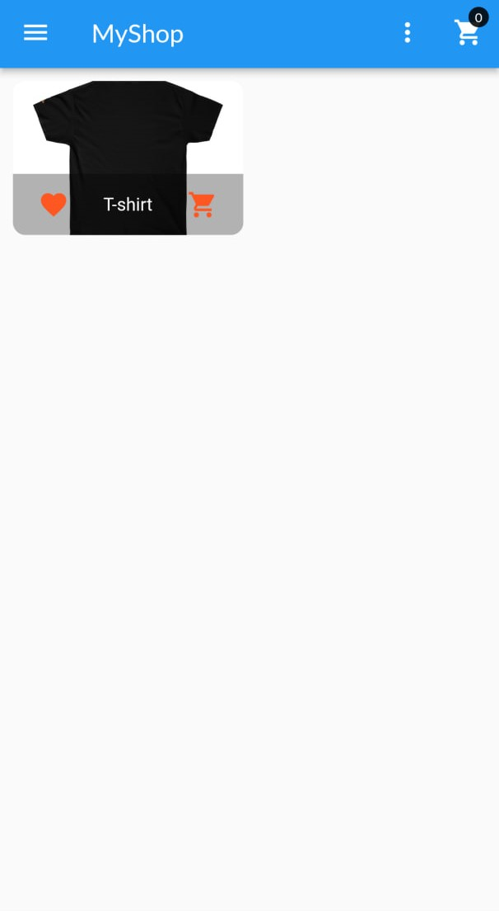
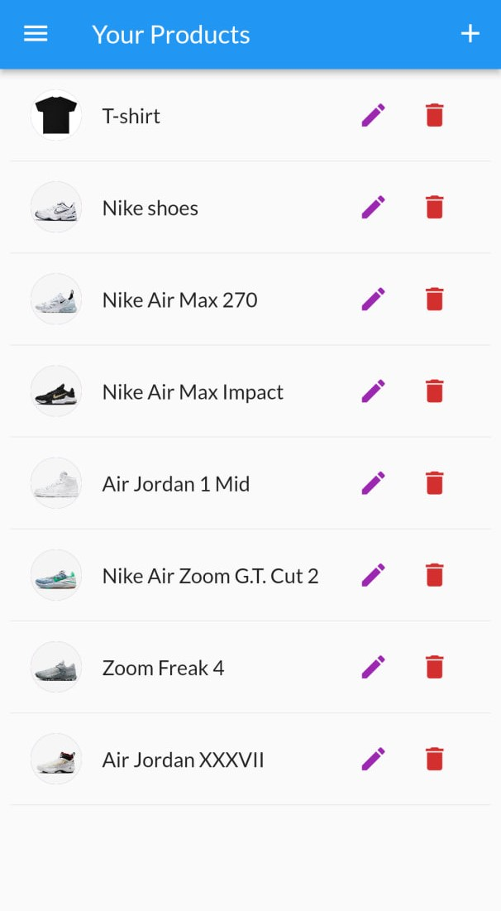
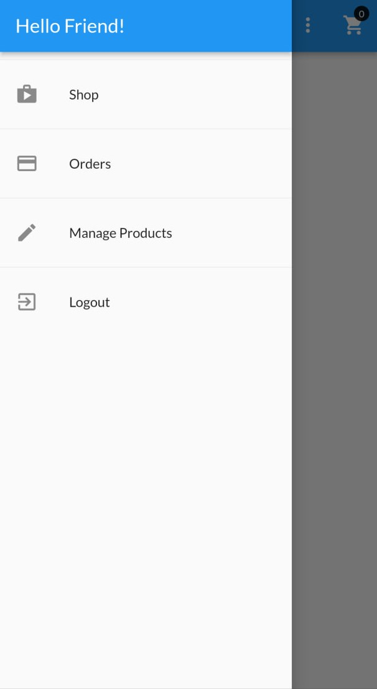
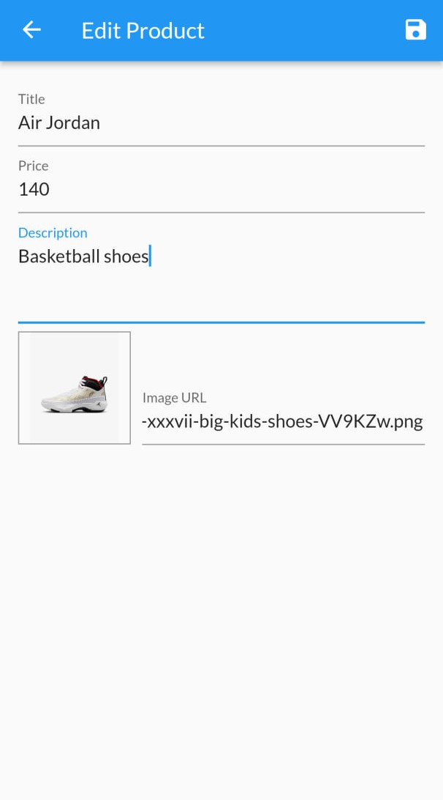
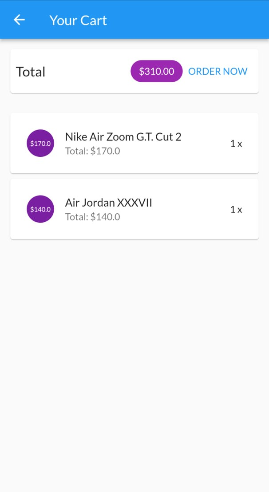
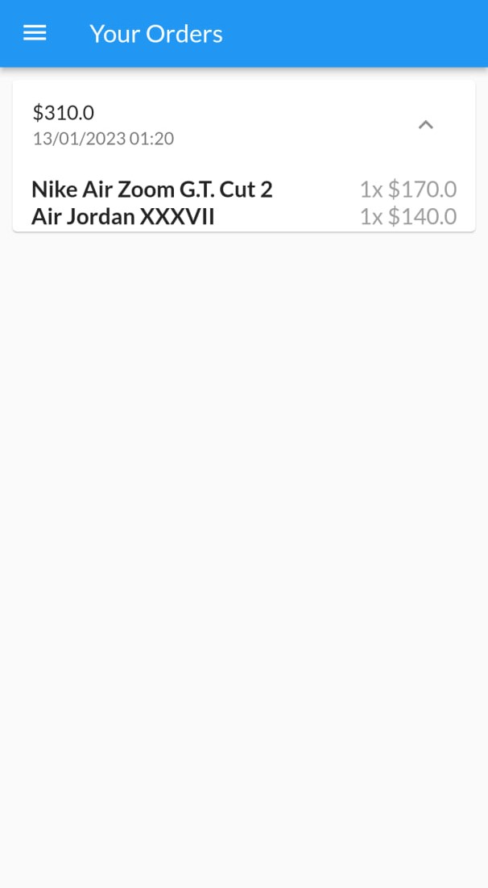

# Shop Application

<h2> Tools that I used </h2>

- Provider for state management 
- User inputs and forms
- Firebase Authentication and Database
- Http request

<h2> Interface of the application </h2>

<table>
  <tr>
    <td>Sign Up Page</td>
     <td>Products Page</td>
     <td>Only Favorites</td>
     <td>Product's List</td>
  </tr>
  <tr>
    <td></td>
    <td></td>
    <td></td>
    <td></td>
  </tr>
  <tr>
    <td>Drawer</td>
     <td>Edit Products</td>
     <td>Cart Page</td>
     <td>Order Page</td>
  </tr>
  <tr>
    <td></td>
    <td></td>
    <td></td>
    <td></td>
  </tr>
 </table>
 
 <h2> Features </h2>
 
 - Authntication using Firebase 
 - Saving items on Firebase Database
 - Using SharedPreferences for local storage 
 - Adding products to Firebase DB through user inputs in UI
 - Creating different list of product according to user ID
 
 <table>
 <tr>
 
 </tr>
 </table>
 
 
 

[1]: http://www.github.com/https://github.com/ramilsalihar
[2]: https://www.linkedin.com/in/https://www.linkedin.com/in/ramil-salihar/
